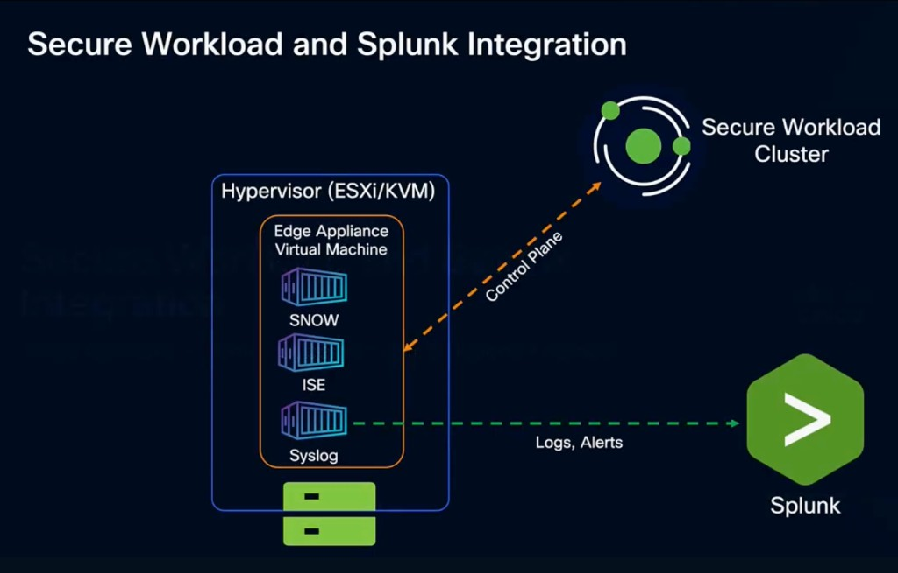

# Cisco Secure Workload → Splunk Integration Guide

A step-by-step integration guide for streaming Cisco Secure Workload (CSW) alerts and compliance events into Splunk using the **Cisco Security Cloud App for Splunk**.

> **⚠ Disclaimer:** This is a **community reference guide** prepared by Cisco Solutions Engineering — not an official Cisco product document. Always refer to the [official Cisco Secure Workload documentation](https://www.cisco.com/c/en/us/support/security/tetration/series.html) and the [Cisco Security Cloud App on Splunkbase](https://splunkbase.splunk.com/app/7404) for authoritative, up-to-date guidance.

---

## What This Covers

| Area | Detail |
|---|---|
| **Architecture** | Edge appliance → Syslog connector (TAN) → Splunk Heavy Forwarder → Cisco Security Cloud App |
| **Prerequisites** | Existing Edge + Ingest appliance; no new VMs required |
| **Alert types** | Compliance, Forensics (MITRE ATT&CK), Enforcement, Sensors, Traffic, Connectors |
| **Splunk app** | Cisco Security Cloud (Splunkbase App ID 7404, v3.6.5) |
| **Verified against** | CSW 4.0/4.1 on-prem and SaaS; Splunk Enterprise 9.x–10.x |

---

## Quick Start

### Prerequisites
- CSW Edge appliance deployed (VM on ESXi or KVM)
- Splunk Enterprise/Cloud ≥ 9.1, CIM 6.x installed
- Firewall rule open: Edge appliance IP → Splunk Heavy Forwarder, UDP/TCP on chosen port

### Steps (summary)

**On Cisco Secure Workload:**
1. `Manage → Workloads → Virtual Appliances` → select Edge appliance
2. Add **Syslog Connector** → set Protocol (UDP/TCP), Splunk HF IP, Port
3. `Alerts → Configuration` → add alert rules → set Publisher = Syslog Connector

**On Splunk:**
1. Install [Cisco Security Cloud](https://splunkbase.splunk.com/app/7404) from Splunkbase
2. Open app → Configure → **Cisco Secure Workload** → fill in Input Name, Protocol, Port, IP, Index
3. Verify: `index=cisco_csw | head 20`

See the [full step-by-step guide](CSW-Splunk-Integration-Guide.md) or [open the HTML version](CSW-Splunk-Integration-Guide.html) for detailed instructions with screenshots.

---

## Video Walkthrough

Cisco Senior SE Jorge Quintero demonstrates the full integration in **8 minutes**:

▶ **[Watch: Secure Workload and Splunk Integration](https://www.youtube.com/watch?v=CRnkH9imTZk)**

| Timestamp | Topic |
|---|---|
| 0:00 – 1:30 | Architecture overview |
| 1:30 – 3:00 | Syslog connector setup in CSW |
| 3:00 – 4:30 | Alert Config rules and publisher selection |
| 4:30 – 6:00 | Cisco Security Cloud App configuration in Splunk |
| 6:00 – 8:42 | CSW dashboard walkthrough and filtering |

---

## Architecture Diagram

*Edge appliance VM hosts the Syslog connector container (alongside SNOW, ISE connectors). Control plane connects to CSW cluster; logs and alerts stream via syslog to Splunk.*

---

## Files in This Repo

| File | Description |
|---|---|
| [`README.md`](README.md) | This file — quick start and overview |
| [`CSW-Splunk-Integration-Guide.md`](CSW-Splunk-Integration-Guide.md) | Full step-by-step guide (Markdown source) |
| [`CSW-Splunk-Integration-Guide.html`](CSW-Splunk-Integration-Guide.html) | Styled HTML — open in browser for best experience (includes embedded YouTube player) |
| [`csw-splunk-architecture.png`](csw-splunk-architecture.png) | Architecture diagram from Cisco SE demo |
| [`build.sh`](build.sh) | Regenerate HTML/PDF from Markdown (requires pandoc + Chrome) |

---

## Alert Types — Quick Reference

| Alert Type | What It Detects | Requires Enforcement? |
|---|---|---|
| **Compliance → Enforcement Policy** | Policy violations / catch-all hits | ✅ Yes — workspace must be enforced |
| **Forensics** (MITRE ATT&CK) | Behavioral anomalies, lateral movement | ❌ No — works in Monitor mode |
| **Sensors** | Agent heartbeat loss / agent down | ❌ No |
| **Traffic** | Communication with known malicious IPs | ❌ No |
| **Connectors** | Connector/appliance health | ❌ No |
| **Enforcement** | Workload firewall off / policy state change | ❌ No |

> **Important:** Compliance alerts require the workspace to be in **Enforcement mode** and the catch-all set to **DENY**. For lateral movement detection before enforcement, use **Forensics** alerts instead.

---

## Related Cisco Secure Workload Resources

| Repository | Description | Best for |
|------------|-------------|---------|
| [User Education](https://github.com/chandrapati/CSW-User-Education) | Onboarding guides and concept explainers | New CSW users |
| [Agent Installation](https://github.com/chandrapati/CSW-Agent-Installation-Guide) | Deploy CSW agents on Linux / Windows / cloud | Day-1 sensor deployment |
| [Policy Lifecycle](https://github.com/chandrapati/CSW-Policy-Lifecycle) | Policy discovery → enforcement workflow | Policy management |
| [ISE / pxGrid](https://github.com/chandrapati/csw-ise-integration) | ISE/pxGrid: user-identity–aware microsegmentation | Identity & Zero Trust |
| [AnyConnect NVM](https://github.com/chandrapati/csw-anyconnect-nvm) | Endpoint process flows + user identity via NVM | Endpoint telemetry |
| [ServiceNow CMDB](https://github.com/chandrapati/csw-servicenow-integration) | ServiceNow CMDB label enrichment for workload scopes | CMDB-driven policy |
| [AWS Connector](https://github.com/chandrapati/csw-aws-connector) | EC2 tag ingestion + VPC flow logs + Security Group enforcement | AWS workloads |
| [Azure Connector](https://github.com/chandrapati/csw-azure-connector) | Azure VM tag ingestion + VNet flow logs + NSG enforcement | Azure workloads |
| [GCP Connector](https://github.com/chandrapati/csw-gcp-connector) | GCE label ingestion + VPC flow logs + firewall enforcement | GCP workloads |
| [NetFlow](https://github.com/chandrapati/csw-netflow-integration) | NetFlow v9/IPFIX agentless flow ingestion from switches | Network fabric visibility |
| [ERSPAN](https://github.com/chandrapati/csw-erspan-integration) | Agentless packet mirroring for legacy / OT / IoT devices | Deep agentless visibility |
| [Secure Firewall](https://github.com/chandrapati/CSW-Secure-Firewall-Integration-Guide) | NSEL flow ingestion from Cisco Secure Firewall (FTD/ASA) | Firewall flow visibility |
| [Splunk Integration](https://github.com/chandrapati/csw-splunk-integration) | CSW syslog alerts → Splunk SIEM | SecOps / SIEM teams |
| [Compliance Mapping](https://github.com/chandrapati/CSW-Compliance-Mapping) | Map CSW controls to NIST, PCI-DSS, HIPAA, CIS | Compliance & audit |
| [Tenant Insights](https://github.com/chandrapati/CSW-Tenant-Insights) | Tenant-level reporting and analytics | Visibility metrics |
| [Operations Toolkit](https://github.com/chandrapati/CSW-Operations-Toolkit) | Day-2 ops scripts: health checks, reporting, policy analysis | Ongoing operations |

> **Suggested customer journey:**  
> User Education → Agent Installation → Policy Lifecycle → ISE/pxGrid → ServiceNow CMDB → Splunk Integration → Compliance Mapping → Operations Toolkit